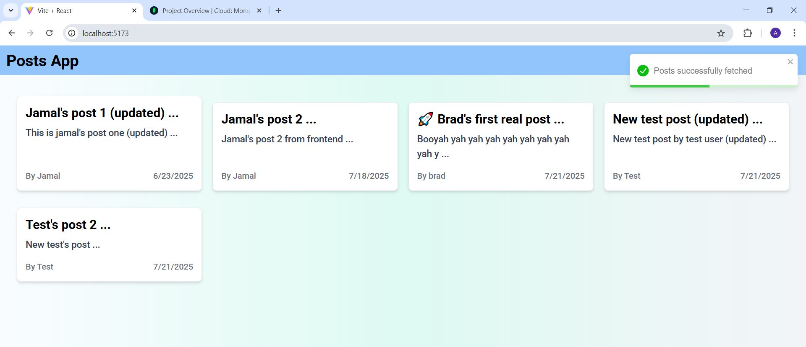

# Posts App

A full-stack blog platform where users can sign up, log in, create, edit, and delete posts. The frontend is built with React and Tailwind CSS for a modern, responsive UI. The backend is built with Node.js, Express, and MongoDB.

## Features

- User authentication (signup, login, logout)
- Create, edit, and delete blog posts
- Responsive design for all devices
- Toast notifications for feedback
- Protected routes for authenticated users

## Technologies

- **Frontend:** React, Tailwind CSS, React Router, React Toastify, Vite
- **Backend:** Node.js, Express, MongoDB, JWT
- **Other:** LocalStorage for token management

## Screenshots

### Homepage



### Login Page


### Signup Page


### Create Post Page


### Post Details Page


### Delete Post Page


### Logout Page


## Getting Started

### Prerequisites

- Node.js & npm installed
- MongoDB instance running
- Backend API running at `http://localhost:8080/api`

### Installation

#### Backend

1. Go to the `server` folder:
   ```bash
   cd server
   ```
2. Install dependencies:
   ```bash
   npm install
   ```
3. Create a `.env` file with the following:
   ```
   PORT=8080
   MONGODB_CONN=your_mongodb_connection_string
   JWT_SECRET=your_jwt_secret
   ```
4. Start the backend server:
   ```bash
   npm start
   ```

#### Frontend

1. Go to the `client` folder:
   ```bash
   cd client
   ```
2. Install dependencies:
   ```bash
   npm install
   ```
3. Start the development server:
   ```bash
   npm run dev
   ```

## Folder Structure

```
Posts-App/
├── client/
│   ├── src/
│   │   ├── components/
│   │   ├── contexts/
│   │   ├── pages/
│   │   ├── requests/
│   │   ├── App.jsx
│   │   ├── main.jsx
│   │   └── index.css
│   ├── public/
│   │   └── screenshots/
│   │       ├── Homepage.JPG
│   │       ├── Login page.JPG
│   │       ├── Signup page.JPG
│   │       ├── Createpost page.JPG
│   │       ├── Post datails page.JPG
│   │       ├── Post delete page.JPG
│   │       └── Logout page.JPG
│   ├── package.json
│   ├── tailwind.config.js
│   └── ...
├── server/
│   ├── controllers/
│   ├── middlewares/
│   ├── models/
│   ├── routes/
│   ├── config/
│   ├── server.js
│   └── ...
└── README.md
```

## Usage

- **Sign Up:** Create a new account.
- **Login:** Access your account.
- **Create Post:** Add a new blog post.
- **Edit/Delete Post:** Manage your posts.
- **Logout:** End your session.

## Customization

- Update API endpoints in the code if your backend runs on a different URL.
- Modify Tailwind classes for custom styling.

## License

MIT

---

**Enjoy blogging!**
